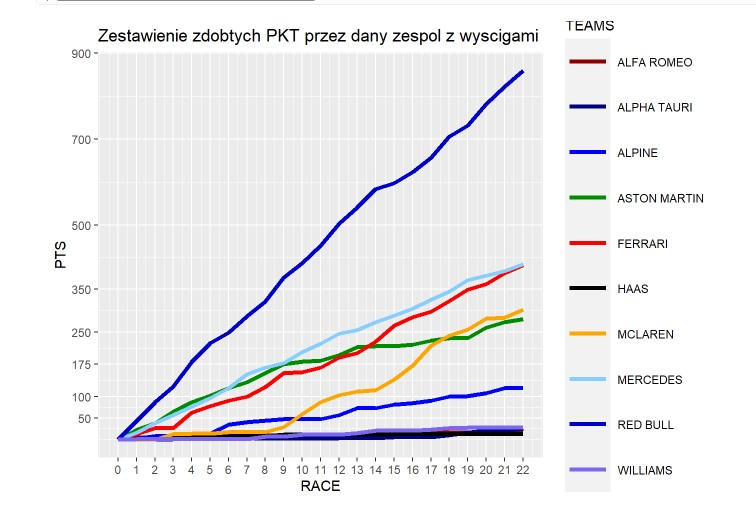

# 🏎️ F1 2023 Season Analysis – Quarto & R

An interactive data analysis report of the 2023 Formula 1 season, built with Quarto and R. The project analyzes driver and constructor standings, visualizes points progression across all 22 races, and demonstrates data processing techniques in R.

---

## 📖 Project Overview

The report covers the full 2023 F1 season — from the Bahrain Grand Prix to Abu Dhabi. It combines data from multiple sources, processes it using tidyverse pipelines, and presents results through interactive tables and ggplot2 visualizations.

Created as part of the **Statistics / Data Analysis** university course.

---

## 🚀 Key Features

- 📊 **Interactive tables** – driver and constructor standings with DT and gt packages
- 📈 **Cumulative points chart** – race-by-race points progression for all 10 teams
- 🔢 **Custom standard deviation function** – implemented manually with a loop
- 🔄 **Pipeline data processing** – tidyverse, group_by, summarise, pivot_longer
- 📁 **Loop file reading** – automatic CSV loading with file extension detection
- 🎨 **Custom styling** – CSS theme, background image, light/dark mode (Zephyr/Materia)
- 📑 **Full Quarto features** – TOC, numbered sections, code folding, math formulas (KaTeX)

---

## 🏆 Data Coverage

**Driver standings** – all 22 drivers from the 2023 season (f1_dane.txt)

**Constructor points per race** – all 10 teams across 22 Grands Prix:

| Team | Total Points |
|------|-------------|
| Red Bull Racing | 860 |
| Mercedes | 409 |
| Ferrari | 406 |
| Aston Martin | 280 |
| McLaren | 302 |
| Alpine | 120 |
| Williams | 28 |
| Haas | 12 |
| Alfa Romeo | 16 |
| AlphaTauri | 25 |

---

## 🛠️ Technologies Used

| Technology | Usage |
|---|---|
| R 4.3+ | Core data processing |
| Quarto | Report generation and HTML output |
| tidyverse | Data manipulation and ggplot2 visualizations |
| gt | Static styled tables |
| DT | Interactive searchable tables |
| rio | Data import from .txt files |
| CSS | Custom report styling |

---


---

## ▶️ How to Run

### Requirements
```r
install.packages(c("tidyverse", "gt", "DT", "rio", "tools"))
```

### Run
```bash
git clone https://github.com/PawelK123/RStudio_WEB_APP.git
cd RStudio_WEB_APP
```

1. Open `RStudio_WEB_APP.Rproj` in RStudio
2. Open `main.qmd`
3. Click **Render** – the report will open in your browser as `Wynik_Końcowy.html`

---

